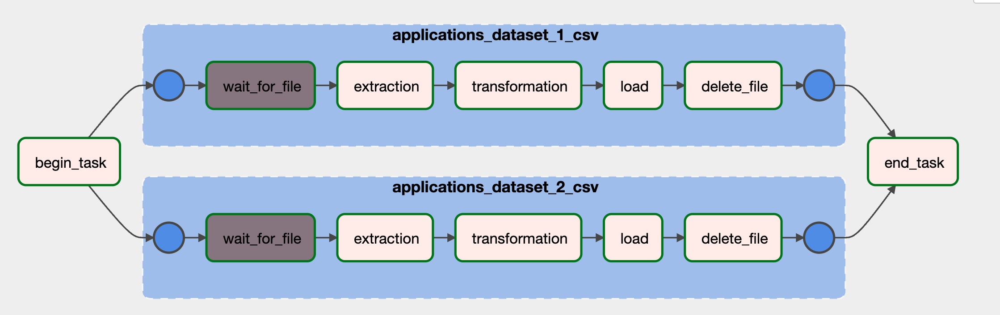

## Section 1: Data Pipelines

### Design

Extracting application data set and performing cleansing and transformation of dataset as per the requirement and Finally loading the successful and unsuccessFul files into respective folders.:

Tech Stack

Airflow Scheduler to perform ETL, Orchestration and Scheduling
Expected time to schedule hourly

### Airflow Components

* maindag.py - Main Routine with dag and taskgroup declaration and calls process routine
* utils.py - extract, transform and load function are defined for easy reference
* constants.py - declaration of important constant variables

### DAG info

* DAG Name: Hourly_Applicant_Transaction
* Tasks
  * Begin - Python Decorator (start time)
  * TaskGroup - Pipeline - 1 (Application dataset 1)
    * extraction
    * transformation
    * load
  * TaskGroup - Pipeline - 2 (Application data set 2)
    * check file exist
    * extraction
    * transformation
    * load
    * delete input file
  * end - Python Decorator (end time)

  
### DAG Flow for Reference



### Output Path

The output files can be found [here](output/)

### Log Path

Log File can be referenced from [here](logs/)


## Setup

Install and setup Docker Swarm

Install docker using Docker Inc's script.
https://github.com/docker/docker-install

    curl -fsSL https://get.docker.com -o get-docker.sh
    sh ./get-docker.sh | tee "docker-install_$(hostname)_$(date +'%Y-%m-%d').txt"

Run in swarm mode for scalability 

    docker swarm init

Check

    docker info

### Airflow setup 

Setup Airflow following [the official instruction](https://airflow.apache.org/docs/apache-airflow/stable/howto/docker-compose/index.html), here brief snippets are shown for quick following.

    curl -LfO 'https://airflow.apache.org/docs/apache-airflow/2.5.3/docker-compose.yaml'

Send files to test server

    rsync -av . dev:~/airflow/

Setting the right Airflow user

```bash 
mkdir -p ./dags ./logs ./plugins
echo -e "AIRFLOW_UID=$(id -u)" > .env
source .env
```

Then, follow Airflow docker compose installation.

### Operation

Run the dockers

    docker compose up -d