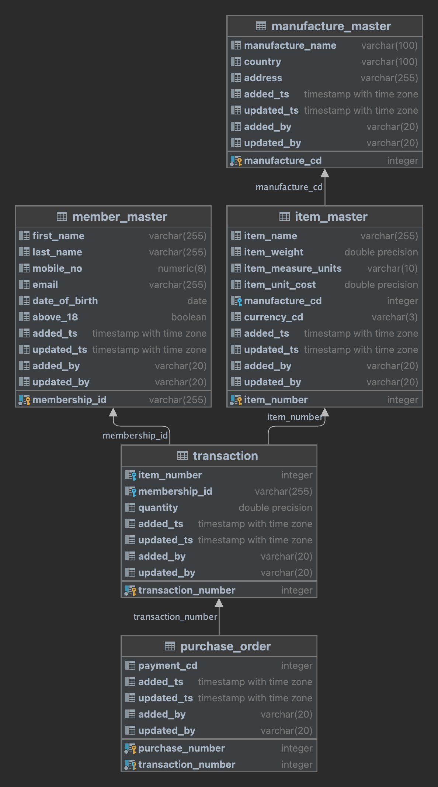

## Section 2: Databases

### Database and Docker set up

Database Name: ecom_db

Schema Name: sales

### Table Details
* #### Code Tables
  * currency :  Define various currency types for different countries (Ref: item- price)
  * payment_method : List types of payments like cash, nets, credit cards (Ref: Purchase order)
* #### Master Tables
  * manufacture_master : (Supplier details)
  * item_master :  (Product information - ref: manufacture for supplier details)
  * member_master :  ( Customer details)
* #### Transaction Tables
  * transaction : product ordered by customer transaction details of 
  * purchase_order : product purchased by customers

### Entity-Relationship Diagram

### Deployment

Run dockers via compose

    docker compose up -d 
