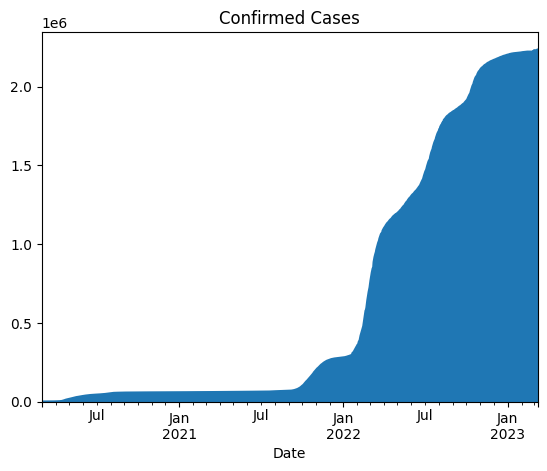
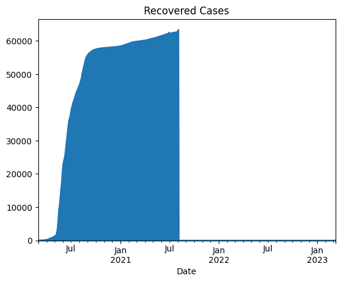
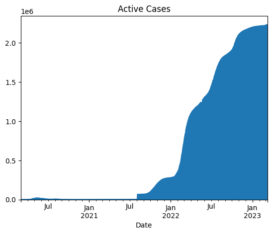

## Section 4: CHARTS & APIs

### Design

Fetch covid19 cases around singapore using a given API, https://covid19api.com/.

Load them in dataframe and set the date period accordingly to go over Singapore covid19 cases

### Python Libraries/Files

* requests - Api library, To fetch covid 19 cases 
* streamlit.py - Display the graph on the browser and it uses pandas dataframe
* covid.py - main program 

### Charts Prepared 

#### Confirmed cases



#### Death cases


#### Recovered cases



#### Active cases



  

### Run Environment (mac)

Can set up virtual Environment and 
```
pip install -r requirement.txt
```

```
jupyter run covid.ipynb
```

### Other Facts :-)
Same solution can also be extended to store API data in database and can be visualised in superset as well


